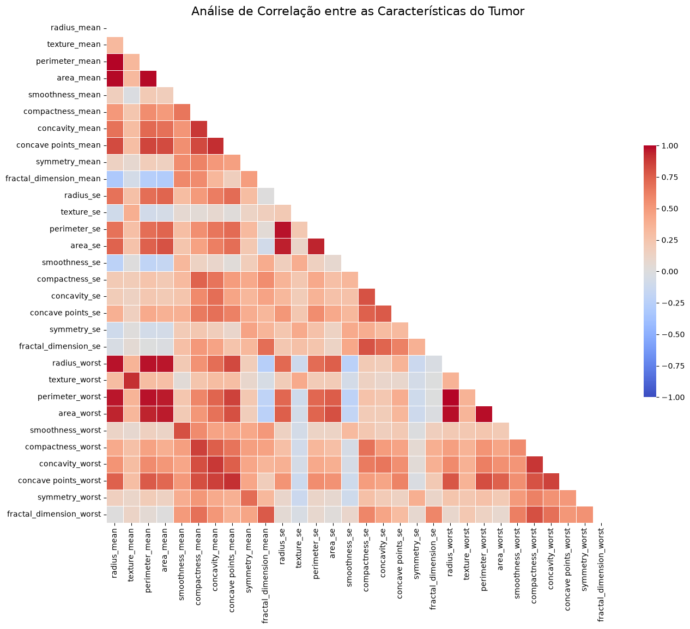
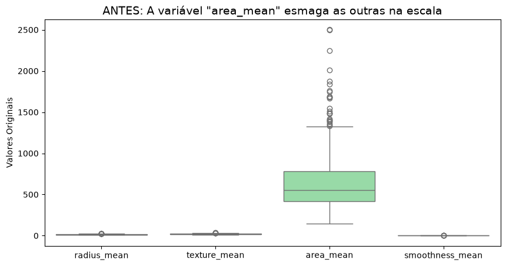
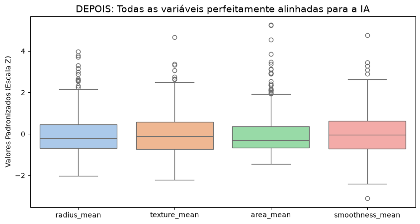
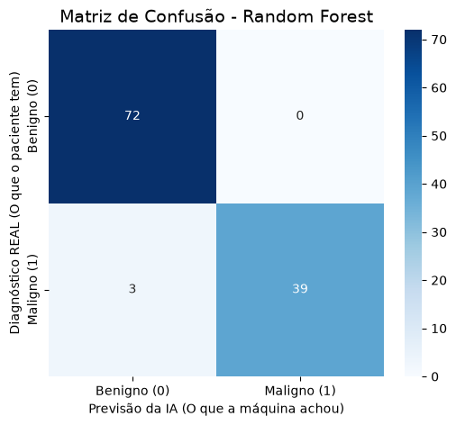
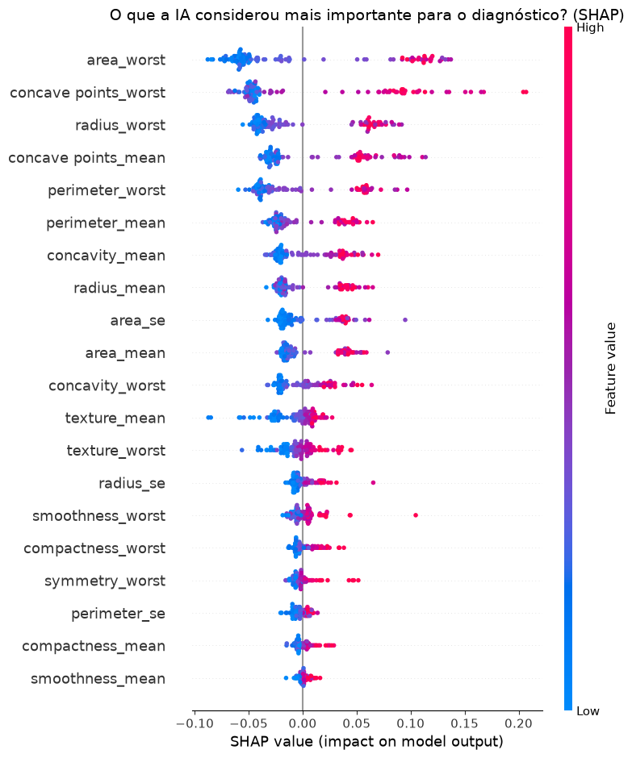

# FIAP Tech Challenge - Fase 1 (IA para Saúde da Mulher)

Este repositório contém a solução inicial para o Tech Challenge da Fase 1, focado no desenvolvimento de um sistema inteligente baseado em Inteligência Artificial para apoiar o diagnóstico e a detecção precoce de riscos à saúde feminina.

## 🎯 O Problema de Negócio

Uma rede de hospitais especializada na saúde da mulher necessita de um sistema inteligente de triagem. Com o volume crescente de pacientes, a instituição precisa acelerar a identificação de situações de risco (focando aqui no diagnóstico de câncer de mama), provendo aos médicos um suporte robusto, explicável e eficiente na tomada de decisões.

**Objetivo:** Construir modelos preditivos capazes de classificar anomalias (Benignas ou Malignas) utilizando dados estruturados e, adicionalmente, modelos de Deep Learning para análise de imagens médicas (Mamografias).

---

## 📂 Estrutura do Repositório

- `tech_challenge.ipynb`: Notebook principal contendo todo o pipeline de Machine Learning com dados tabulares (limpeza, EDA, padronização, treinamento e validação).
- `modelo_cnn_imagens.ipynb`: Notebook (EXTRA) contendo o desenvolvimento da Rede Neural Convolucional (CNN) para o diagnóstico por meio de imagens médicas.
- `data.csv`: Base de dados tabular utilizada no desafio principal. **Fonte:** [Diagnóstico de câncer de mama (maligno ou benigno) - Kaggle](https://www.kaggle.com/datasets/uciml/breast-cancer-wisconsin-data/data)
- `/dataset_imagens/` e arquivos `.zip`: Dados para o modelo EXTRA de Visão Computacional. *(Nota: Não versionados no Git devido ao limite de tamanho).* **Fonte:** [Detecção de câncer de mama em mamografias (CBIS-DDSM) - Kaggle](https://www.kaggle.com/datasets/awsaf49/cbis-ddsm-breast-cancer-image-dataset)
- `Dockerfile`: Configuração de contêiner para execução isolada do ambiente.

---

## 🔬 Relatório Técnico

### 1. Discussões da Análise Exploratória (EDA)
Foi realizada a leitura da base estruturada, removendo colunas sem importância preditiva (como o ID da paciente e colunas vazias de formatação do Kaggle). 
A estatística descritiva (médias, mínimos, máximos) revelou que as variáveis possuíam escalas numéricas drasticamente diferentes (ex: `area_mean` possuía valores muito altos comparados à `smoothness_mean`).
Geramos também uma **Matriz de Correlação** mapeada por Heatmap, identificando alta colinearidade entre algumas features de tamanho (como raio e perímetro), o que é esperado do ponto de vista fisiológico.



### 2. Estratégias de Pré-processamento
- **Tratamento de Categóricas:** Conversão da variável alvo (`diagnosis`) de texto ('M', 'B') para inteiros binários (`1` para Maligno, `0` para Benigno).
- **Separação Treino/Teste:** Divisão de 80% dos dados para treino e 20% para teste, utilizando o parâmetro `stratify=y` para garantir que a proporção de casos malignos e benignos se mantivesse idêntica em ambos os conjuntos, evitando viés de amostragem.
- **Padronização (Scaling):** Devido à diferença de escala identificada na EDA, foi aplicado o `StandardScaler`. O escalonador foi ajustado (`fit`) **apenas nos dados de treino**, e aplicado (`transform`) nos dados de teste. Isso preveniu o *data leakage* (vazamento de informações do futuro para o treino).




### 3. Modelos Usados e Porquê
Para garantir confiabilidade diagnóstica, construímos e comparamos duas abordagens:
*   **Regressão Logística:** Escolhido por ser um modelo de base (baseline) excelente, rápido e altamente interpretável para classificações binárias matemáticas.
*   **Random Forest (Floresta Aleatória):** Escolhido por ser um modelo do tipo *Ensemble* (várias árvores de decisão juntas). Ele costuma lidar melhor com não-linearidades e interações complexas entre variáveis biológicas, além de ser menos sensível a pequenos *outliers*.

### 4. Resultados, Interpretação e Explicabilidade
Os modelos foram validados em dados cegos usando métricas clínicas cruciais:
*   **Accuracy (Acurácia):** Taxa de acerto global.
*   **Recall (Sensibilidade):** A métrica mais importante neste contexto médico. Ela responde: *"De todos os casos que eram realmente câncer maligno, quantos a IA conseguiu pegar?"*. Falsos negativos custam vidas.
*   **F1-Score:** Equilíbrio harmônico entre precisão e recall.

* **Resultados Regressão Logística:** Accuracy: 96.49%, Recall: 92.86%, F1-Score: 95.12%
* **Resultados Random Forest:** Accuracy: 97.37%, Recall: 92.86%, F1-Score: 96.30%



**Explicabilidade com SHAP:** 
Como um médico precisa confiar no algoritmo, aplicamos a biblioteca SHAP (SHapley Additive exPlanations) no modelo Random Forest. O modelo não é uma "caixa-preta". O *Summary Plot* do SHAP comprovou quais características do núcleo celular (como os pontos côncavos, perímetro e área) tiveram maior peso e orientaram matematicamente a IA para concluir que o tumor era maligno.



---

## 🚀 Como Executar o Projeto

**Opção 1: Via Python Local**
1. Clone este repositório.
2. Certifique-se de ter o Python instalado.
3. Instale as dependências:
   ```bash
   pip install pandas numpy scipy scikit-learn matplotlib seaborn shap jupyter
   ```
4. Abra o Jupyter Notebook:
   ```bash
   jupyter notebook
   ```
5. Execute as células sequencialmente em `tech_challenge.ipynb`.

**Opção 2: Via Docker (Recomendado)**
1. Construa a imagem: 
   ```bash
   docker build -t fiap-tech-challenge .
   ```
2. Rode o container: 
   ```bash
   docker run -p 8888:8888 fiap-tech-challenge
   ```
3. Acesse o link gerado no terminal para abrir o Jupyter Notebook.

---
**Vídeo de Demonstração:** [Insira aqui o Link do YouTube/Vimeo]
