# FIAP Tech Challenge - Fase 1 (IA para Saúde da Mulher)

Este repositório contém a solução desenvolvida para o **Tech Challenge da Fase 1 da FIAP**, com foco na aplicação de Inteligência Artificial para apoiar o diagnóstico e a detecção precoce de riscos relacionados à saúde da mulher.

O projeto principal utiliza dados clínicos estruturados para classificar tumores de mama como **benignos ou malignos**. Como atividade complementar, também foi desenvolvido um modelo experimental de Deep Learning para análise de imagens médicas.

> **Aviso:** este projeto possui finalidade exclusivamente acadêmica e não substitui a avaliação de profissionais da saúde.

---

## 🎯 O Problema de Negócio

Uma rede de hospitais especializada na saúde da mulher necessita de um sistema inteligente de triagem. Com o aumento do volume de pacientes, a instituição precisa acelerar a identificação de situações de risco e oferecer aos profissionais da saúde um suporte eficiente, explicável e baseado em dados.

**Objetivo:** construir e avaliar modelos preditivos capazes de classificar tumores como benignos ou malignos, comparando diferentes algoritmos e utilizando técnicas de explicabilidade para compreender as decisões dos modelos.

---

## 📂 Estrutura do Repositório

```text
FIAP_TechChallenge_01_2026/
├── tech_challenge.ipynb
├── modelo_cnn_imagens.ipynb
├── data.csv
├── csv/
├── dataset_imagens/          # Não versionada no Git
├── imagens_resultados/
├── Relatorio_Entrega.docx
├── Dockerfile
├── .gitignore
└── README.md
```

- `tech_challenge.ipynb`: notebook principal com limpeza, EDA, pré-processamento, treinamento, comparação, validação, otimização e explicabilidade.
- `modelo_cnn_imagens.ipynb`: notebook EXTRA com uma Rede Neural Convolucional para imagens médicas.
- `data.csv`: base tabular utilizada na etapa obrigatória.
- `csv/`: arquivos auxiliares relacionados à base de imagens.
- `dataset_imagens/`: imagens organizadas nas classes benigno e maligno. Não foi versionada devido ao tamanho.
- `imagens_resultados/`: gráficos gerados automaticamente pelo notebook principal.
- `Relatorio_Entrega.docx`: relatório técnico da entrega.
- `Dockerfile`: ambiente isolado para execução do notebook principal.

---

## 🗂️ Bases de Dados

### Base principal

Foi utilizado o dataset **Breast Cancer Wisconsin Diagnostic**, disponível no Kaggle:

[Breast Cancer Wisconsin Data](https://www.kaggle.com/datasets/uciml/breast-cancer-wisconsin-data/data)

A base possui:

- 569 registros;
- 30 características numéricas;
- 357 diagnósticos benignos;
- 212 diagnósticos malignos;
- variável-alvo `diagnosis`.

Para o treinamento, o diagnóstico foi convertido para:

- `0`: Benigno;
- `1`: Maligno.

### Base de imagens - EXTRA

Para o experimento de visão computacional foi utilizada uma amostra organizada a partir do dataset **CBIS-DDSM**:

[CBIS-DDSM Breast Cancer Image Dataset](https://www.kaggle.com/datasets/awsaf49/cbis-ddsm-breast-cancer-image-dataset)

As imagens foram organizadas localmente da seguinte forma:

```text
dataset_imagens/
├── benigno/
└── maligno/
```

A pasta `dataset_imagens/` e os arquivos compactados não foram enviados ao GitHub porque possuem tamanho elevado e estão incluídos no `.gitignore`.

---

## 🔬 Relatório Técnico

### 1. Inspeção e limpeza dos dados

Inicialmente foram analisados o formato da base, os tipos das variáveis, os valores ausentes, os registros duplicados e a distribuição dos diagnósticos.

Durante a limpeza foram removidas:

- a coluna `id`, por não possuir valor preditivo;
- a coluna `Unnamed: 32`, por estar completamente vazia;
- possíveis linhas duplicadas.

Também foram calculadas estatísticas descritivas como média, desvio padrão, valores mínimos, máximos e quartis.

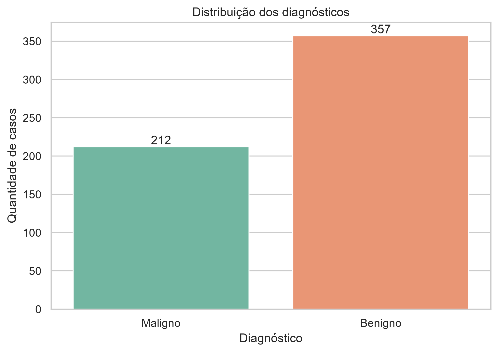

### 2. Análise Exploratória dos Dados (EDA)

Foram criados gráficos de distribuição e boxplots para observar o comportamento das principais características em casos benignos e malignos.

As variáveis com maior correlação com o diagnóstico foram:

- `concave points_worst`;
- `perimeter_worst`;
- `concave points_mean`;
- `radius_worst`;
- `perimeter_mean`;
- `area_worst`;
- `radius_mean`;
- `area_mean`.

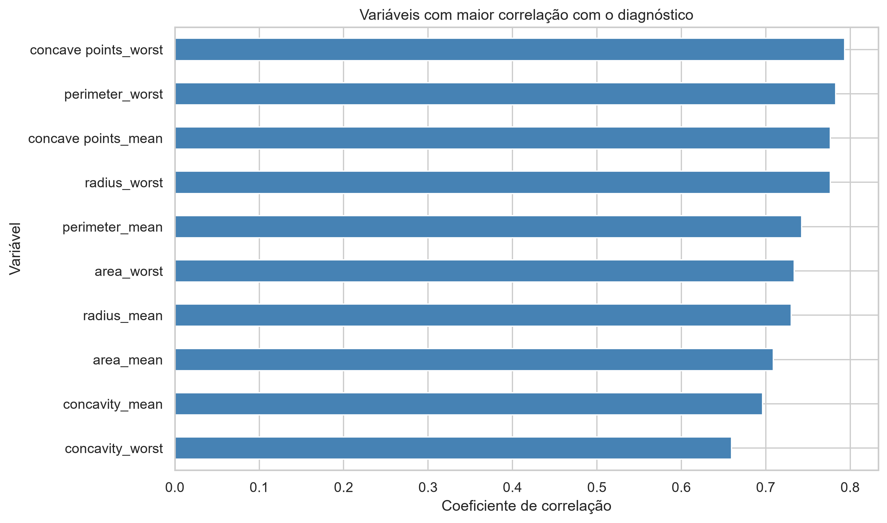

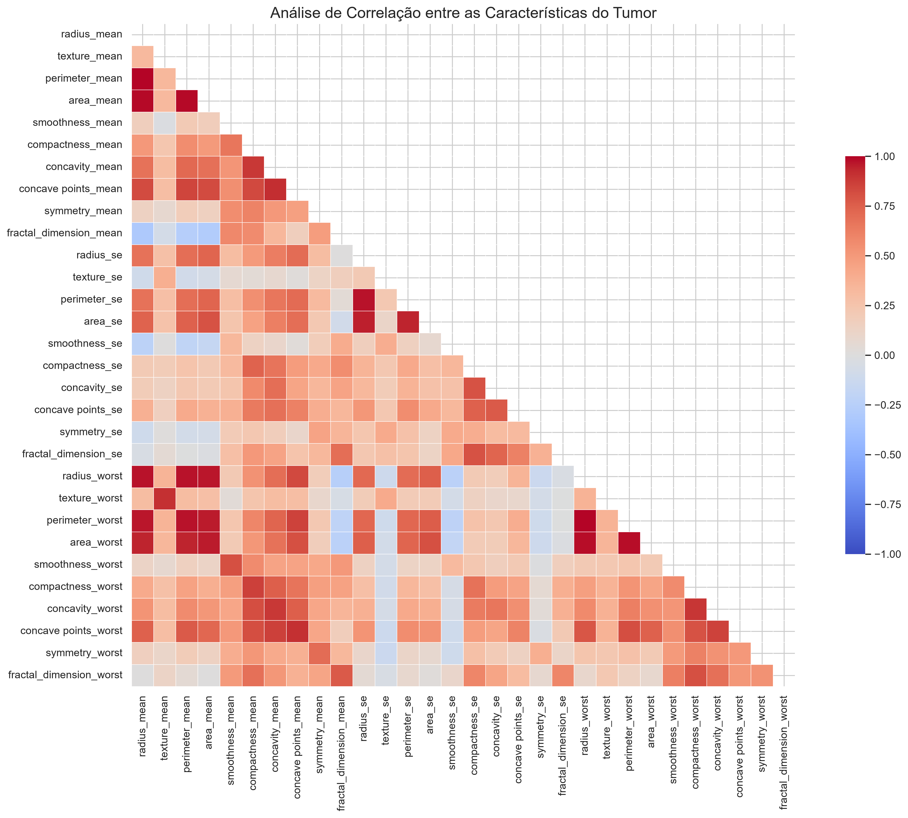

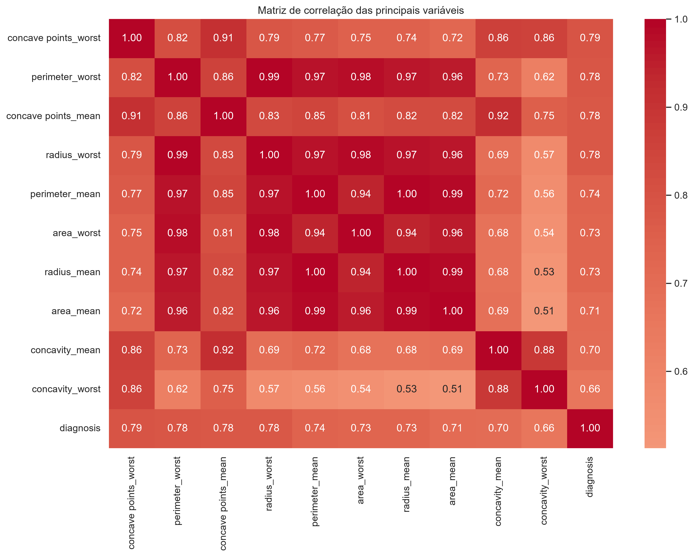

### 3. Estratégias de pré-processamento

- **Conversão da variável-alvo:** `B` foi convertido para `0` e `M` para `1`.
- **Separação treino/teste:** 80% dos registros foram utilizados no treinamento e 20% no teste.
- **Estratificação:** foi utilizado `stratify=y` para preservar a proporção das classes.
- **Reprodutibilidade:** foi definido `random_state=42`.
- **Padronização:** o `StandardScaler` foi ajustado somente nos dados de treinamento e aplicado posteriormente ao conjunto de teste, evitando _data leakage_.

A divisão resultou em 455 registros para treinamento e 114 registros para teste.

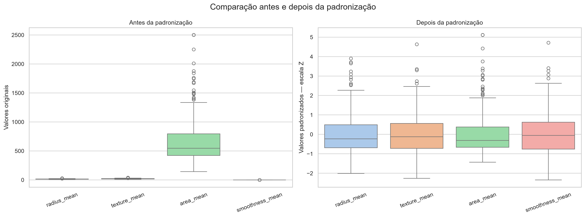

---

## 🤖 Modelos Avaliados

Foram treinados e comparados quatro algoritmos:

1. **Regressão Logística:** modelo rápido, interpretável e adequado para classificação binária.
2. **K-Nearest Neighbors (KNN):** classifica cada registro considerando os exemplos mais próximos.
3. **Árvore de Decisão:** produz decisões interpretáveis por meio de regras hierárquicas.
4. **Random Forest:** combina várias árvores para representar relações não lineares e reduzir a variância.

A Regressão Logística e o KNN foram implementados em um `Pipeline` com o `StandardScaler`, garantindo que o pré-processamento fosse aplicado corretamente durante o treinamento e a validação.

---

## 📏 Métricas de Avaliação

- **Accuracy:** proporção total de previsões corretas.
- **Precision:** entre os casos previstos como malignos, quantos realmente eram malignos.
- **Recall:** entre os casos realmente malignos, quantos foram identificados.
- **F1-score:** equilíbrio entre precision e recall.
- **ROC-AUC:** capacidade de separação entre as classes.

O **recall da classe maligna** recebeu atenção especial, pois um falso negativo representa um caso maligno não identificado pelo modelo.

---

## 📊 Resultados dos Modelos

| Modelo              | Accuracy | Precision | Recall | F1-score | ROC-AUC |
| ------------------- | -------: | --------: | -----: | -------: | ------: |
| Regressão Logística |   96,49% |    97,50% | 92,86% |   95,12% |  99,60% |
| Random Forest       |   96,49% |   100,00% | 90,48% |   95,00% |  99,42% |
| KNN                 |   95,61% |    97,44% | 90,48% |   93,83% |  98,23% |
| Árvore de Decisão   |   92,11% |    94,59% | 83,33% |   88,61% |  94,48% |

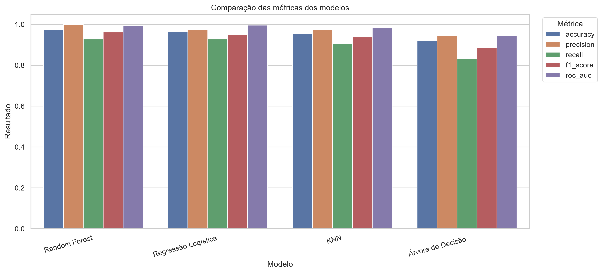

### Matrizes de confusão

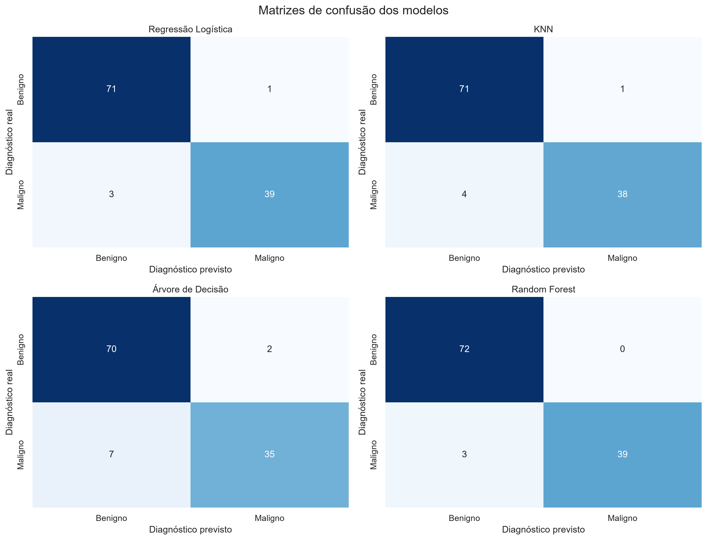

### Curvas ROC

As curvas ROC mostram o comportamento dos modelos em diferentes limiares de decisão. A Regressão Logística apresentou o maior ROC-AUC no conjunto de teste.

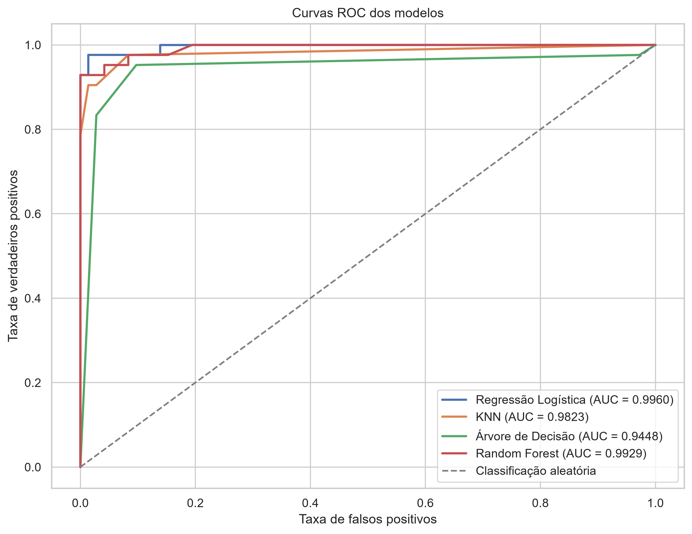

---

## 🔁 Validação Cruzada

Foi utilizada validação cruzada estratificada com cinco folds:

```python
StratifiedKFold(n_splits=5, shuffle=True, random_state=42)
```

A Regressão Logística apresentou o melhor equilíbrio entre recall médio, F1-score médio, ROC-AUC médio e estabilidade.

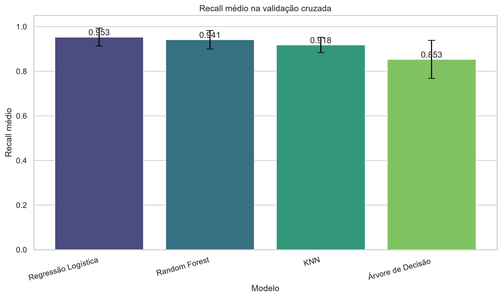

---

## ⚙️ Otimização de Hiperparâmetros

O modelo candidato foi otimizado com `GridSearchCV`, utilizando o recall como métrica principal. Os melhores hiperparâmetros encontrados foram:

```text
C = 1
class_weight = balanced
```

### Resultado do modelo final

| Métrica   | Resultado |
| --------- | --------: |
| Accuracy  |    97,37% |
| Precision |    97,56% |
| Recall    |    95,24% |
| F1-score  |    96,39% |
| ROC-AUC   |    99,54% |

A otimização aumentou o recall de 92,86% para 95,24%.

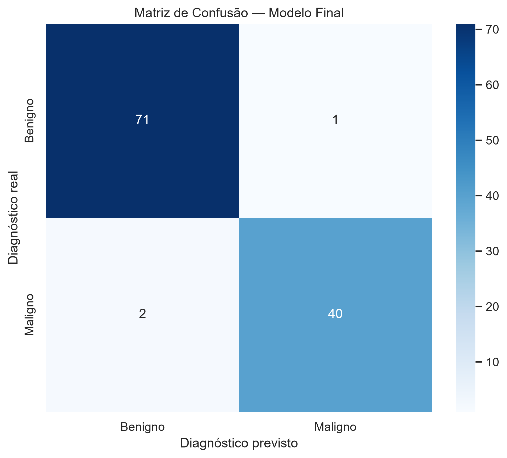

---

## 🔎 Explicabilidade

### Importância por permutação

A importância por permutação mede quanto o desempenho diminui quando os valores de uma variável são embaralhados.

Entre as características mais relevantes estão `texture_worst`, `concavity_worst`, `symmetry_worst`, `concave points_worst`, `concave points_mean` e `radius_worst`.

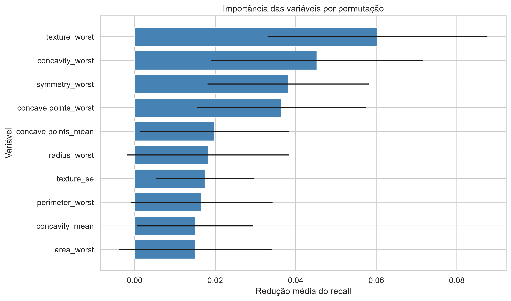

### SHAP

O SHAP foi utilizado para apresentar a importância global, a direção do impacto das variáveis e uma explicação individual de um caso maligno.

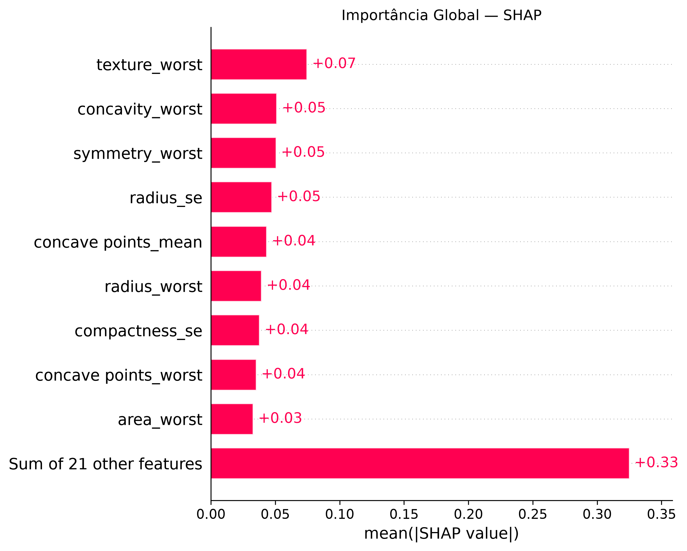

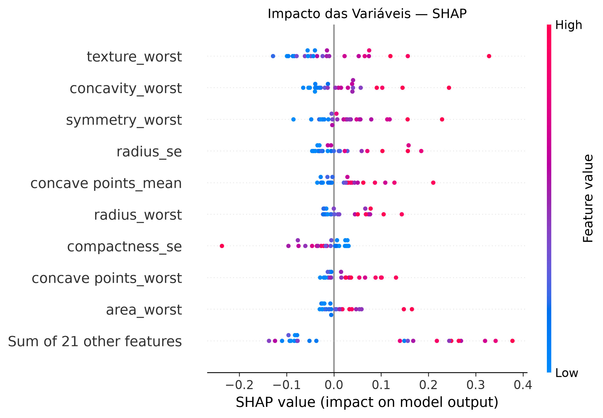

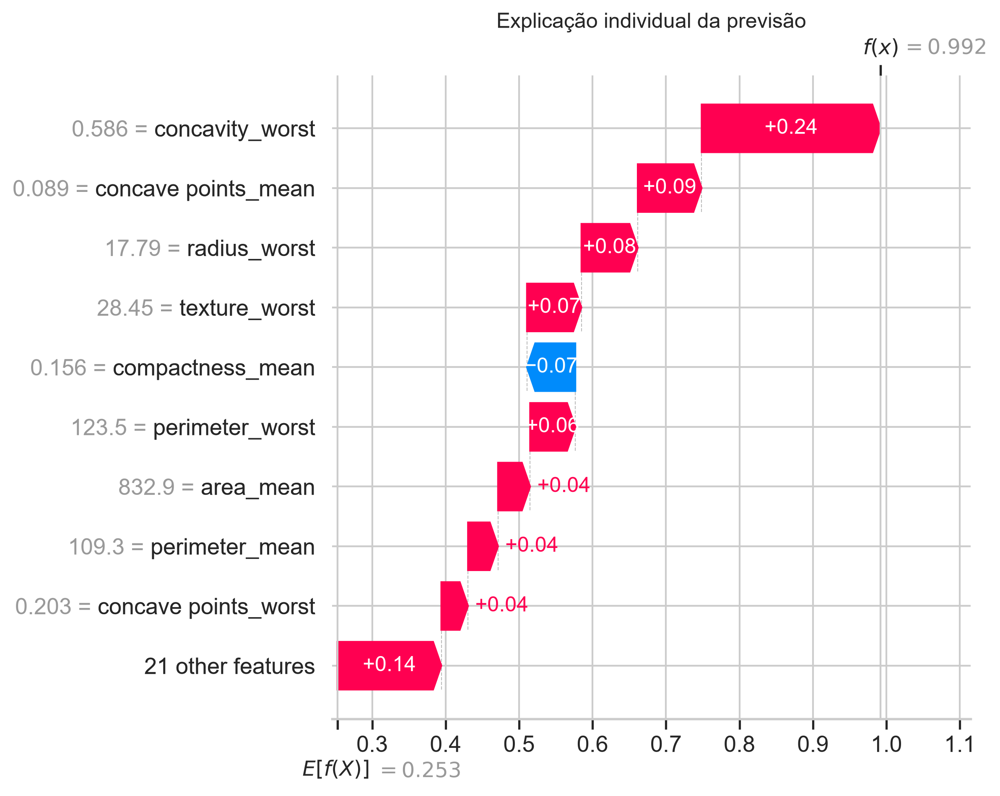

---

## 🩻 Modelo de Imagens - EXTRA

Como atividade complementar, foi construída uma Rede Neural Convolucional com TensorFlow/Keras, contendo camadas `Conv2D`, `MaxPooling2D`, `Flatten`, uma camada densa com 512 neurônios e saída `sigmoid`.

As imagens foram redimensionadas para `150 × 150` pixels. Na execução registrada foram utilizadas:

- 990 imagens para treinamento;
- 247 imagens para validação;
- 10 épocas.

| Métrica  | Treinamento | Validação |
| -------- | ----------: | --------: |
| Accuracy |      95,32% |    58,70% |
| Recall   |      93,38% |    64,17% |
| Loss     |      0,1379 |    1,7940 |

A diferença entre treinamento e validação indica **overfitting**. Portanto, a CNN é apresentada como experimento complementar, com possibilidades futuras de aplicar _data augmentation_, `Dropout`, `EarlyStopping`, _transfer learning_ e uma base maior e mais equilibrada.

---

## 🚀 Como Executar o Projeto

### Opção 1: Python local

```bash
git clone https://github.com/nacnaya/FIAP_TechChallenge_01_2026.git
cd FIAP_TechChallenge_01_2026
python -m venv venv
```

Ative o ambiente no Windows:

```powershell
venv\Scripts\activate
```

Instale as dependências:

```bash
pip install pandas numpy scipy scikit-learn matplotlib seaborn shap kagglehub jupyter
```

Inicie o Jupyter:

```bash
jupyter notebook
```

Abra `tech_challenge.ipynb` e execute todas as células.

### Opção 2: Google Colab

1. Envie `tech_challenge.ipynb` ao Google Colab.
2. Execute todas as células em ordem.
3. Caso `data.csv` não esteja disponível, o notebook poderá obter a base por meio do `kagglehub`.
4. Os gráficos serão armazenados em `imagens_resultados/`.

### Opção 3: Docker

O Docker atual está preparado para executar o notebook principal.

```bash
docker build -t fiap-tech-challenge .
docker run --rm -p 8888:8888 fiap-tech-challenge
```

Abra o endereço exibido no terminal, acesse `tech_challenge.ipynb` e execute todas as células.

> O notebook EXTRA requer TensorFlow e a pasta local `dataset_imagens/`. Essas dependências não estão incluídas na imagem Docker atual.

Para executar o EXTRA localmente, instale também:

```bash
pip install "numpy<2.0.0" tensorflow==2.17.0 pillow
```

### Opção 4: Script automático (Windows)

Para facilitar a execução no Windows sem precisar digitar comandos Docker manualmente, o repositório inclui o script `projeto.bat`.

O script verifica se o Docker está instalado e em execução, constrói a imagem, inicia o container automaticamente em uma porta livre, aguarda o Jupyter ficar pronto e abre o navegador sozinho já no endereço correto (com o token de acesso incluído).

**Como usar:**

1. Dê duplo clique em `projeto.bat` (ou execute-o pelo terminal).
2. No menu exibido, escolha:
   - `[1]` **Iniciar projeto** — constrói a imagem (se necessário), inicia o container e abre o Jupyter automaticamente no navegador.
   - `[2]` **Encerrar projeto** — para o container em execução.
   - `[3]` **Verificar status** — mostra se o Docker está ativo e se o projeto está rodando (e em qual porta).
   - `[4]` **Sair**
3. Quando terminar de usar o notebook, volte ao script e escolha `[2]` para encerrar o container.

> O script detecta automaticamente uma porta livre no seu computador, então não há conflito caso a porta 8888 já esteja em uso por outro programa.

---

## 📦 Dependências Principais

- Python;
- Pandas;
- NumPy;
- SciPy;
- Scikit-learn;
- Matplotlib;
- Seaborn;
- SHAP;
- KaggleHub;
- Jupyter Notebook;
- TensorFlow e Pillow para o EXTRA.

---

## ✅ Conclusão

Os quatro modelos apresentaram resultados relevantes, mas a Regressão Logística demonstrou o melhor equilíbrio entre desempenho, estabilidade e interpretabilidade.

Após a otimização, o modelo final atingiu recall de **95,24%** e ROC-AUC de **99,54%**. A validação cruzada, a otimização e as técnicas de explicabilidade tornaram a análise mais completa e transparente.

O modelo de imagens demonstrou a possibilidade de aplicar uma CNN ao problema, mas os resultados de validação indicaram overfitting e a necessidade de melhorias futuras.

---

## 📋 Entregáveis

- Notebook principal de Machine Learning;
- notebook EXTRA de imagens;
- base tabular;
- gráficos dos resultados;
- relatório técnico em Word;
- README com instruções de execução;
- Dockerfile;
- vídeo de apresentação.

---

## 🎥 Vídeo de Demonstração

Adicionar o link após a publicação:

```text
https://www.youtube.com/watch?v=tn2XRHDf70M
```
